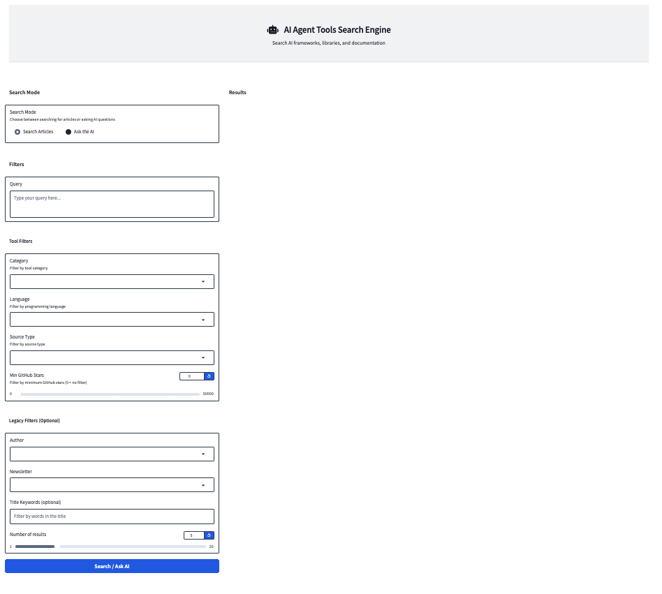

# 🤖 AI Agent Tools RAG Search Engine



<div align="center">

<!-- Project Status -->

[](https://github.com/karenwhite33/agents-tool-rag/actions/workflows/ci.yml)
[](https://github.com/karenwhite33/agents-tool-rag/actions/workflows/cd.yml)


[](https://opensource.org/licenses/MIT)
[](https://www.python.org/downloads/)
[](https://github.com/astral-sh/uv)

<!-- Providers -->

[](https://supabase.com/)
[](https://qdrant.tech/)
[](https://cloud.google.com/run)
[](https://www.prefect.io/)
[](https://fastapi.tiangolo.com/)
[](https://gradio.app/)

</div>

<p align="center">
  <em>A comprehensive RAG-powered search engine for discovering AI agent frameworks, libraries, and tools from RSS feeds, GitHub repositories, and documentation sites</em>
</p>

## 📚 Table of Contents

- [AI Agent Tools Search Engine](#ai-agent-tools-search-engine)
  - [📚 Table of Contents](#-table-of-contents)
  - [✨ Overview](#-overview)
  - [🗂️ Project Structure](#️-project-structure)
  - [⚡ Quickstart](#-quickstart)
    - [🛠️ Prerequisites](#️-prerequisites)
    - [⬇️ Installation](#️-installation)
  - [📝 Makefile Commands](#-makefile-commands)
  - [⚙️ Settings \& Configuration](#️-settings--configuration)
    - [🔢 Embedding Models](#-embedding-models)
  - [🔌 Services Providers](#-services-providers)
    - [🗄️ Supabase](#️-supabase)
    - [🧠 Qdrant](#-qdrant)
    - [⚡ Prefect](#-prefect)
    - [⚡ FastAPI](#-fastapi)
      - [Example Queries](#example-queries)
    - [☁️ Google Cloud Run](#️-google-cloud-run)
    - [🎨 Gradio UI (Optional)](#-gradio-ui-optional)
    - [🤖 Opik Integration (Optional)](#-opik-integration-optional)
  - [🧪 Tests](#-tests)
  - [✅ Quality Checks](#-quality-checks)
  - [📄 License](#-license)

## ✨ Overview

This project is a robust Retrieval-Augmented Generation (RAG) system designed to make AI agent tools, frameworks, and libraries easily searchable and accessible. It automates the ingestion of content from RSS feeds, GitHub repositories, and documentation sites. Content is stored in a Supabase PostgreSQL database, while semantic embeddings are generated and indexed in a Qdrant vector database for efficient similarity search.

The data pipeline is orchestrated using Prefect, enabling scheduled, reliable, and reproducible ingestion and embedding workflows. Prefect ensures that new content is regularly fetched, processed, and made available for search without manual intervention.

The backend is powered by a FastAPI application that exposes a set of RESTful endpoints for querying the ingested articles. Users can:

- **Search for articles by unique titles** (fast, keyword-based, no LLM required)
- **Ask natural language questions** about the ingested articles, with answers generated by LLMs in both streaming and non-streaming modes

Multiple LLM providers are supported, including OpenRouter (default, with a generous free tier), OpenAI, and Hugging Face. For OpenAI and Hugging Face, you will need to supply your own API keys.

For user interaction, this repository includes a Gradio-based UI for local exploration and prototyping.

## 🗂️ Project Structure

```text
├── .github/                                   # GitHub configuration and CI/CD workflows
│   ├── workflows/
│   │   ├── ci.yml
│   │   └── cd.yml
├── frontend/                                  # React (Vite) UI — main web app
│   ├── src/
│   ├── package.json
│   └── ...
├── gradio-frontend/                           # Gradio UI for local testing and demos
│   ├── __init__.py
│   └── app.py
├── src/                                       # Main backend source code
│   ├── config.py                              # Global configuration loader
│   ├── api/                                   # FastAPI application and API logic
│   │   ├── exceptions/                        # Custom exception handlers
│   │   │   ├── __init__.py
│   │   │   └── exception_handlers.py
│   │   ├── main.py                            # FastAPI app entry point
│   │   ├── middleware/                        # Middleware (logging)
│   │   │   ├── __init__.py
│   │   │   └── logging_middleware.py
│   │   ├── models/                            # Pydantic models for API and providers
│   │   │   ├── __init__.py
│   │   │   ├── api_models.py
│   │   │   └── provider_models.py
│   │   ├── routes/                            # API route definitions
│   │   │   ├── __init__.py
│   │   │   ├── health_routes.py
│   │   │   └── search_routes.py
│   │   └── services/                          # Service layer
│   │       ├── __init__.py
│   │       ├── generation_service.py
│   │       ├── search_service.py
│   │       └── providers/                     # LLM and embedding providers
│   │          ├── __init__.py
│   │          ├── huggingface_service.py
│   │          ├── openai_service.py
│   │          ├── openrouter_service.py
│   │          └── utils/                      # Provider utilities
│   │              ├── __init__.py
│   │              ├── evaluation_metrics.py
│   │              ├── messages.py
│   │              └── prompts.py
│   ├── configs/                               # List of RSS/feed configs
│   │   ├── feeds_rss.yaml
│   ├── infrastructure/                        # Infrastructure integrations
│   │   ├── __init__.py
│   │   ├── qdrant/                            # Qdrant vector DB integration
│   │   │   ├── __init__.py
│   │   │   ├── qdrant_vectorstore.py
│   │   │   ├── create_collection.py
│   │   │   ├── delete_collection.py
│   │   │   ├── ingest_from_sql.py
│   │   │   └── create_indexes.py
│   │   ├── supabase/                          # Supabase DB integration
│   │   │   ├── __init__.py
│   │   │   ├── create_db.py
│   │   │   ├── delete_db.py
│   │   │   └── init_session.py
│   ├── models/                                # Pydantic models for SQLAlchemy and vectorstore
│   │   ├── __init__.py
│   │   ├── article_models.py
│   │   ├── sql_models.py
│   │   └── vectorstore_models.py
│   ├── pipelines/                             # Prefect flows and tasks
│   │   ├── __init__.py
│   │   ├── flows/                             # Prefect flow definitions
│   │   │   ├── __init__.py
│   │   │   ├── embeddings_ingestion_flow.py
│   │   │   └── rss_ingestion_flow.py
│   │   ├── tasks/                             # Prefect task definitions
│   │   │   ├── __init__.py
│   │   │   ├── ingest_embeddings.py
│   │   │   ├── fetch_rss.py
│   │   │   └── ingest_rss.py
│   └── utils/                                 # Utility functions (logging, text splitting)
│       ├── __init__.py
│       ├── logger_util.py
│       └── text_splitter.py
├── tests/                                     # Unit and integration tests
│   ├── conftest.py                            # Pytest configuration
│   ├── integration/                           # Integration tests (DB, pipeline)
│   │   ├── test_db_connection.py
│   │   └── test_rss_pipeline.py
│   ├── test_models/                           # Test table model
│   │   └── test_sql_models.py
│   ├── unit/                                  # Unit tests
│   │   ├── test_fastapi.py
│   │   └── test_fetch_rss_entries.py
├── static/                                    # Static assets (images, etc.)
│   └── image.png
├── cloudbuild_fastapi.yaml                    # Google Cloud Build config for FastAPI
├── deploy_fastapi.sh                          # Script to deploy FastAPI to Cloud Run
├── Dockerfile                                 # Dockerfile for FastAPI app
├── prefect-cloud.yaml                         # Prefect Cloud deployment config
├── prefect-local.yaml                         # Prefect local deployment config
├── LICENSE                                    # Project license
├── Makefile                                   # Automation commands
├── pyproject.toml                             # Project dependencies
├── README.md                                  # Project Overview
├── INSTRUCTIONS.md                            # Project Installation Instructions
├── requirements.txt                           # Prefect deployment dependencies
├── uv.lock                                    # uv dependency lock file
```

## ⚡ Quickstart

Get started quickly by following these steps. This project is designed to be accessible for both beginners and advanced users.

### 🛠️ Prerequisites

Before installation, ensure you have the following tools and accounts set up. These are the minimum requirements for running the pipeline, database, vector store, and LLM provider:

| Requirement                                      | Description           |
| ------------------------------------------------ | --------------------- |
| [Python 3.12](https://www.python.org/downloads/) | Pprogramming language |
| [uv](https://docs.astral.sh/uv/)                 | Packaging tool        |
| [Prefect](https://docs.prefect.io/)              | Flows Orchestrator    |
| [Supabase](https://supabase.com/docs)            | SQL Database          |
| [Qdrant](https://qdrant.tech/)                   | Vector Database       |
| [OpenRouter](https://www.openrouter.com/)        | LLM Provider          |

You do not need the following optional components to run the pipeline unless you plan to use them. The deployment in Google Cloud Run will provide you with an endpoint to serve the app globally. The Gradio UI provides you with a user-friendly interface for interacting with the model, and Opik integration can be used to run evaluations (GEval metric implemented).

| Requirement                                                   | Description                                                 |
| ------------------------------------------------------------- | ----------------------------------------------------------- |
| [Docker](https://docs.docker.com/get-docker/)                 | Containerization platform                                   |
| [Google Cloud SDK](https://cloud.google.com/sdk/docs/install) | Command-line interface for Google Cloud                     |
| [Gradio](https://gradio.app/get_started)                      | UI library                                                  |
| [Opik](https://www.comet.com/site/products/opik/)             | Model evaluation and monitoring (requires `OPENAI_API_Key`) |

### ⬇️ Installation

Clone the repository, install dependencies, and set up your environment variables:

```bash
git clone https://github.com/karenwhite33/agents-tool-rag.git
cd agents-tool-rag
uv sync --all-groups
source .venv/bin/activate
cp .env.example .env
```

## 📝 Makefile Commands

The Makefile streamlines all common development, deployment, and maintenance tasks. Use it to manage databases, run flows, start services, and check code quality. To see all available commands:

```bash
make help   # Display all available commands
```

```bash
# Supabase
supabase-create                # Create Supabase database
supabase-delete                # Delete Supabase database

# Qdrant
qdrant-create-collection       # Create Qdrant collection
qdrant-delete-collection       # Delete Qdrant collection
qdrant-create-index            # Create Qdrant index
qdrant-ingest-from-sql         # Ingest data from SQL to Qdrant

# Prefect flows
ingest-rss-articles-flow       # Ingest RSS articles flow
ingest-embeddings-flow         # Ingest embeddings flow

# Prefect deployment
deploy-cloud-flows             # Deploy Prefect flows to Prefect Cloud
deploy-local-flows             # Deploy Prefect flows to Prefect Local Server

# Recreate resources
recreate-supabase              # Recreate Supabase resources
recreate-qdrant                # Recreate Qdrant resources
recreate-all                   # Recreate Qdrant and Supabase resources

# Run services
run-api                        # Run FastAPI application
run-gradio                     # Run Gradio application

# Tests
unit-tests                     # Run all unit tests
integration-tests              # Run all integration tests
all-tests                      # Run all tests

# Quality checks
pre-commit-run                 # Run pre-commit hooks
ruff-check                     # Check code lint violations
ruff-check-fix                 # Auto-format code using Ruff
ruff-format                    # Check code format violations
ruff-format-fix                # Auto-format code using Ruff
all-check                      # Run all: linting, formatting and type checking
all-fix                        # Run all fix: auto-formatting and linting fixes
mypy                           # Run MyPy static type checker
clean                          # Clean up cached generated files

# Help
help                           # Display this help message
```

## ⚙️ Settings & Configuration

All sensitive credentials, API keys, and model settings are managed via environment variables and configuration files. This allows you to easily switch between providers and models.

Edit the following files to configure your deployment:

- **Project Settings**: `src/config.py`
  - **Necessary**: Qdrant, Supabase, Prefect, OpenRouter
  - **Optional**:
    - From the above optional services listed above Google Cloud Run is configured in the CLI, so no need to set anything here. Gradio does not require any settings and Opik integration requires only the `OPENAI_API_KEY`, which can be set in the `.env` file.
    - See below for details on enabling Jina or Hugging Face embeddings if desired.
- **RSS / Feeds config**: `src/configs/feeds_rss.yaml`

### 🔢 Embedding Models

The default embedding backend is [Fastembed](https://qdrant.github.io/fastembed/examples/Supported_Models/#supported-text-embedding-models) with the "BAAI/bge-base-en-v1.5" model, providing high-quality English text embeddings. You can easily swap in other supported models by updating the `QDRANT__DENSE_MODEL_NAME` variable in your `.env` file and in `src/config.py`.

The code enables Jina or Hugging Face embeddings. To do so, set `use_jina` or `use_hf` to `True` in the `AsyncQdrantVectorStore` class (`src/infrastructure/vectorstores/qdrant_vectorstore.py`) and provide the necessary API keys and model names in the configuration files. This flexibility allows you to experiment with different embedding providers and optimize for your use case. By setting `True`, the rest of the code does not need to be changed.

```bash
# -------------------------------
# Jina settings (optional)
# -------------------------------
self.jina_settings = settings.jina
self.use_jina = False  # Set to True to enable Jina integration

# -------------------------------
# Hugging Face settings (optional)
# -------------------------------
self.hugging_face_settings = settings.hugging_face

self.hf_client = InferenceClient(
    provider="auto",
    api_key=self.hugging_face_settings.api_key,
)
self.hf_model = self.hugging_face_settings.model
self.use_hf = False  # Set to True to enable HF integration
```

## 🔌 Services Providers

This project integrates several best-in-class open-source and cloud services to provide a scalable, production-ready RAG pipeline:

| Service  | Description                           | Docs/Links                                                                  |
| -------- | ------------------------------------- | --------------------------------------------------------------------------- |
| Supabase | PostgreSQL database for articles      | [Supabase](https://supabase.com/docs)                                       |
| Qdrant   | Vector DB for embeddings              | [Qdrant](https://qdrant.tech/documentation/database-tutorials/bulk-upload/) |
| Prefect  | Orchestration for ingestion/embedding | [Prefect](https://docs.prefect.io/)                                         |
| FastAPI  | API for querying/search               | [FastAPI](https://fastapi.tiangolo.com/)                                    |
| Gradio   | Optional UI                           | [Gradio](https://gradio.app/get_started)                                    |
| Opik AI  | Optional LLM evaluation               | [Opik](https://opik.ai/)                                                    |
| Google Cloud Run | Deployment and hosting         | [Cloud Run](https://cloud.google.com/run/docs)                                            |

______________________________________________________________________

### 🗄️ Supabase

Supabase acts as the primary relational database, storing all ingested article metadata and content. You must create a Supabase project and update your `.env` file with the connection details. The free tier is sufficient for the current setup (only 10% capacity usage).

```bash
SUPABASE_DB__TABLE_NAME=rss_articles
SUPABASE_DB__HOST=your_supabase_db_host_here
SUPABASE_DB__NAME=postgres
SUPABASE_DB__USER=your_supabase_db_user_here
SUPABASE_DB__PASSWORD=your_supabase_db_password_here
SUPABASE_DB__PORT=6543
```

You should end up with a connection string like this:

```sql
postgresql://[USER]:[PASSWORD]@[HOST]:[PORT]/[NAME]
```

To find the values go to you Supabase project dashboard and click on the "connect" button on the middle of the screen. you shall see the following. If you select the "Transaction Pool" method, you will get the correct host to use.

[](static/supabase_string.png)

For example:

- user: postgres.apbkobhfnmcqqzqeeqss
- host: aws-1-us-east-2.pooler.supabase.com (take the transaction pool host)
- port: 6543
- name: postgres

Once configured, use the Makefile commands to create or delete the Supabase database schema:

```bash
make supabase-create
make supabase-delete
```

### 🧠 Qdrant

Qdrant is a high-performance vector database used to store and search article embeddings. It enables fast, scalable semantic search over your content. The collection created supports dense and sparse vectors and quantization. Payload indexes are created on `feed_author`, `feed_name`, and `title` fields to optimize search queries.

Required settings in your `.env` file:

```bash
QDRANT__API_KEY=your_qdrant_api_key_here
QDRANT__URL=your_qdrant_url_here
```

Use the provided Makefile commands to create/delete, index, and manage your Qdrant collections. The ingestion from SQL command will bulk upload all articles from Supabase to Qdrant without using Prefect.

```bash
make qdrant-create-collection
make qdrant-delete-collection
make qdrant-create-index
make qdrant-ingest-from-sql
```

After bulk uploading data, make sure you run `make qdrant-create-index` to enable HNSW and Optimizers apart from the indexes. These two parameters are disabled during bulk upload for [performance reasons](https://qdrant.tech/documentation/database-tutorials/bulk-upload/).

### ⚡ Prefect

Prefect is used for workflow orchestration, ensuring that data ingestion and embedding generation are reliable and repeatable. Three main flows are provided:

1. **RSS Ingestion Flow**: Fetches the latest articles from RSS feeds and stores them in Supabase.
1. **Qdrant Embeddings Flow**: Generates and stores vector embeddings for all articles, making them searchable via semantic queries.

Required settings in your `.env` file:

```bash
PREFECT__API_KEY=your_prefect_api_key_here
PREFECT__WORKSPACE=your_prefect_workspace_here
PREFECT__API_URL=your_prefect_api_url_here
```

You can run these flows manually or schedule them for automated operation. All flows are defined in the `src/pipelines/flows/` directory and can be deployed to Prefect Cloud or a local Prefect server. Prefect Cloud offers 500 minutes/month on the free tier, so I recommend using it for the final deployment and scheduling and during development use the local server.

Run flows:

```bash
make ingest-rss-articles-flow
make ingest-embeddings-flow
```

The `ingest-embeddings-flow` commands support an optional `FROM_DATE` argument to limit processing to articles published after a specific date (format: `YYYY-MM-DD`).

Run the flow with date arguments:

```bash
make ingest-embeddings-flow FROM_DATE=2023-01-01
```

To deploy flows to Prefect Cloud or your own Prefect server using the prefect yaml configuration, run the following commands. Then you can run the flows from the Prefect UI or CLI:

```bash
make deploy-cloud-flows
make deploy-local-flows
```

Make sure you are logged into Prefect Cloud or your local Prefect server before deploying, and your prefect CLI is configured to use the correct profile.

Cloud:

```bash
prefect cloud login
```

Local:

```bash
prefect server start
prefect worker start --pool '<YOUR_POOL_NAME>' # Start a worker for your local server to execute flows
```

You must create the necessary secrets in Prefect for database and Qdrant access and an authorization token block for GitHub to allow Prefect to clone the repository.

| Service                 | Description                           |
| ----------------------- | ------------------------------------- |
| my-gh-creds             | GitHub Credentials Access Token Block |
| qdrant--api-key         | Qdrant API Key Secret                 |
| qdrant--collection-name | Qdrant Collection Name Secret         |
| qdrant--url             | Qdrant URL Secret                     |
| supabase-db--table-name | Supabase DB Table Name Secret         |
| supabase-db--host       | Supabase DB Host Secret               |
| supabase-db--name       | Supabase DB Name Secret               |
| supabase-db--password   | Supabase DB Password Secret           |
| supabase-db--port       | Supabase DB Port Secret               |
| supabase-db--user       | Supabase DB User Secret               |

If you to to trigger the flows from the CLI instead of the UI, you can use the following commands:

```bash
prefect deploy src/pipelines/flows/rss_ingestion_flow.py:rss_ingest_flow -n rss_ingest_flow

prefect deployment run 'rss_ingest_flow/rss_ingest_flow'
```

```bash
prefect deploy src/pipelines/flows/embeddings_ingestion_flow.py:qdrant_ingest_flow -n qdrant_ingest_flow

prefect deployment run 'qdrant_ingest_flow/qdrant_ingest_flow' --param from_date="2022-01-01"
```

### ⚡ FastAPI

The FastAPI backend exposes a high-performance REST API for searching and querying your AI agent tools corpus. It supports both traditional keyword-based search and advanced LLM-powered question answering. The API is designed for easy integration with custom UIs, automation scripts, or third-party tools.

Supported LLM providers:

- **OpenRouter** (default, free tier available, bring your own API key): It is configured with auto model selection prioritizing latency. Feel free to change it in this file `src/api/models/provider_models.py` if you want to use a specific model.
- **OpenAI** (bring your own API key)
- **Hugging Face** (bring your own API key)

Under `src/api/services/providers` you can find these three model providers. You can easily add more providers by following the existing structure. For all, you need to set the respective API keys in your `.env` file. The rest of the code does not need to be changed.

```bash
OPENROUTER__API_KEY=your_openrouter_api_key_here
OPENAI__API_KEY=your_openai_api_key_here
HUGGING_FACE__API_KEY=your_huggingface_api_key_here
```

To run the FastAPI application locally:

```bash
make run-api
```

API endpoints (see `src/api/main.py` and `src/api/routes/search_routes.py` for details):

| Endpoint                | Description                                      |
| ----------------------- | ------------------------------------------------ |
| `/search/unique-titles` | Retrieve unique article titles (no LLM required) |
| `/search/ask`           | Ask questions (non-streaming, LLM-powered)       |
| `/search/ask/stream`    | Ask questions (streaming, LLM-powered)           |

#### Example Queries

You can test the API endpoints using `curl` commands. Make sure your FastAPI server is running locally on port 8080 (default).

```bash
# Health
curl -X GET "http://127.0.0.1:8080/health" | jq
# Non-streaming
curl -X POST "http://127.0.0.1:8080/search/ask" -H "Content-Type: application/json" -d '{"query_text": "RAG and agentic applications", "limit": 5}' | jq
# Streaming
curl -X POST "http://127.0.0.1:8080/search/ask/stream" -H "Content-Type: application/json" -d '{"query_text": "RAG and agentic applications", "limit": 5}'
# Unique titles
curl -X POST "http://127.0.0.1:8080/search/unique-titles" -H "Content-Type: application/json" -d '{"query_text": "RAG and agentic applications", "limit": 5}' | jq
```

### ☁️ Google Cloud Run

You can deploy the FastAPI backend to Google Cloud Run for scalable, serverless hosting. Use the provided `deploy_fastapi.sh` script, customizing the project ID, service name, and region as needed. The script will build the Docker image using the `cloudbuild_fastapi.yaml` file, push it to Google Container Registry, and deploy it to Cloud Run. Once deployed, your API will be accessible via a public HTTPS endpoint.

```bash
gcloud run services describe <YOUR_SERVICE_NAME> --platform managed --region YOUR_REGION --format "value(status.url)"
```

The endpoint URL can be set in the Gradio UI `.env` file as follows:

```bash
BACKEND_URL=your_fastapi_backend_url_here
```

### 🎨 Frontends

- **React frontend** (`frontend/`): Vite + React app. Run with `cd frontend && npm install && npm run dev` → [http://localhost:5173](http://localhost:5173). Use this for production (e.g. deploy to Vercel).
- **Gradio UI** (`gradio-frontend/`, optional): Simple Gradio UI in `gradio-frontend/app.py` for local testing. Run at [http://localhost:7860](http://localhost:7860) or use:

```bash
make run-gradio
```


### 🤖 Opik Integration (Optional)

The Opik integration, located in `service/providers/utils/evaluation_metrics.py`, enables automated evaluation of LLM responses using the GEval metric. This is useful for benchmarking and improving the quality of your question-answering system. To enable, set your OpenAI API key in the `.env` file.

```bash
OPIK__API_KEY=your_opik_api_key_here
OPIK__PROJECT_NAME=ai-agent-tools
```

Additionally, in the evaluation script, you must enable the OpenAI Key by commenting out the following line:

```python
settings.openai.api_key = None
```

The integration does not support at the moment Hugging Face. If you want to use it, please use OpenRouter or OpenAI as a provider or check other possibilities in the [Opik integration documentation](https://www.comet.com/docs/opik/tracing/integrations/overview).

## 🧪 Tests

Comprehensive unit and integration tests are provided to ensure the reliability of all components. Integration tests use a dedicated Supabase test database (see `test_models` folder) to avoid interfering with production data. To run tests, use the Makefile commands. Feel free to extend the test suite as you add new features.

```bash
make unit-tests
make integration-tests
make all-tests
```

## ✅ Quality Checks

Code quality is enforced using `pre-commit` hooks, `ruff` for linting and formatting, and `mypy` for static type checking. All quality checks and auto-fixes can be run via the Makefile, ensuring a consistent and maintainable codebase.

Additional checks can be added to the `.pre-commit-config.yaml` file. Current additional checks include:

- `gitleaks` for detecting hardcoded secrets
- `mdformat` for formatting markdown files

## 📄 License

This project is licensed under the MIT License. See [LICENSE](LICENSE) for details.
