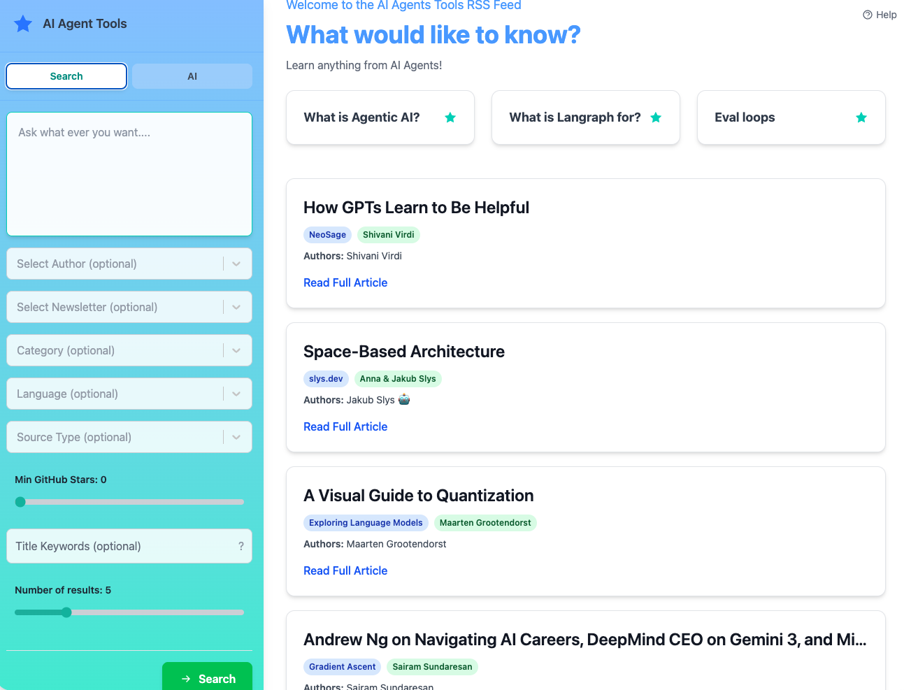

# AI Agent Tools — React Frontend



React + TypeScript + Vite frontend for the **AI Agent Tools** search engine. Search AI frameworks, libraries, and docs; ask questions with multiple LLM providers (OpenRouter, HuggingFace, OpenAI).

## Table of Contents

- [Project Structure](#project-structure)
- [Features](#features)
- [Technologies](#technologies)
- [Setup](#setup)
- [Environment Variables](#environment-variables)
- [License](#license)

## Project Structure

```text
frontend/
├── public/           # Static assets
├── src/
│   ├── api/          # Backend API client
│   ├── components/   # React components
│   ├── data/         # Feeds and model config
│   ├── App.tsx
│   └── main.tsx
├── index.html
├── package.json
├── tailwind.config.js
├── tsconfig.*.json
└── vite.config.ts
```

## Features

- **Search**: Query tools/articles by keywords, filters (category, language, source type, stars).
- **Ask AI**: Streamed or one-shot answers over your indexed content with multiple providers.
- **Multi-provider**: OpenRouter, HuggingFace, OpenAI with model selection.

## Technologies

- React, TypeScript, Vite
- Tailwind CSS
- Backend: FastAPI (see repo root)

## Setup

From the **repository root** (this repo is a monorepo; the frontend lives in `frontend/`):

```bash
cd frontend
npm install
npm run dev
```

App: [http://localhost:5173](http://localhost:5173)

**Clone the full project:**

```bash
git clone https://github.com/karenwhite33/agents-tool-rag.git
cd agents-tool-rag/frontend
npm install
npm run dev
```

**Production build:**

```bash
npm run build
npm run preview   # optional: preview dist/
```

## Environment Variables

Create `frontend/.env` (or `.env.local`). See `frontend/.env.example`.

| Variable           | Description                    |
|--------------------|--------------------------------|
| `VITE_BACKEND_URL` | FastAPI base URL (no trailing slash) |
| `VITE_API_KEY`     | API key (same as backend `API_KEY`)  |

Example:

```env
VITE_BACKEND_URL=http://localhost:8080
VITE_API_KEY=your-api-key
```

## License

MIT — see [LICENSE](LICENSE).
